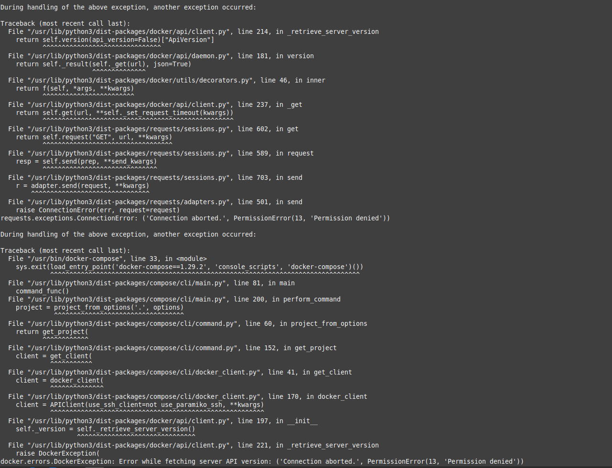
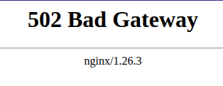
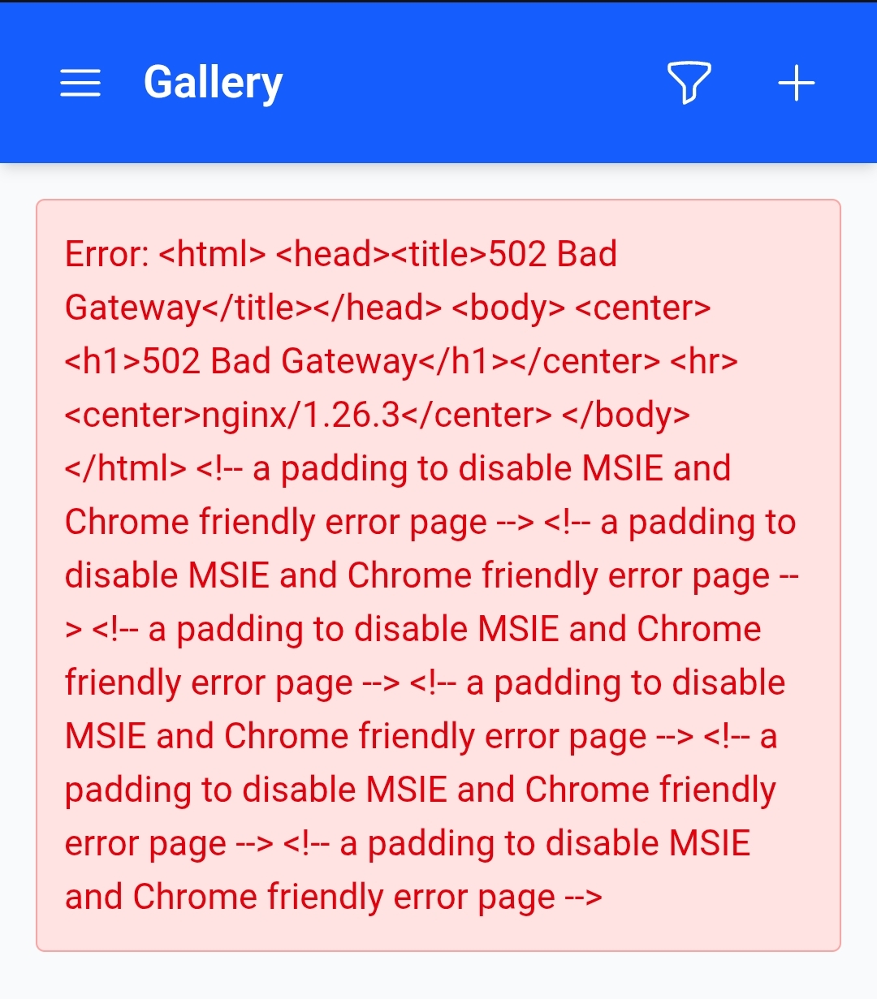
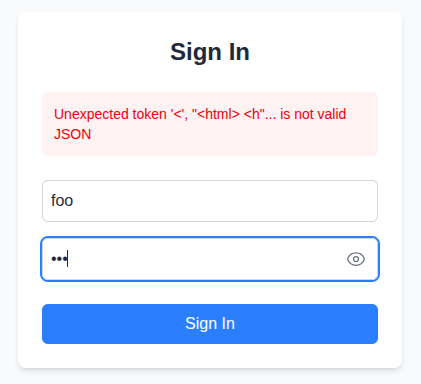

# Portable Party Portal - Monorepo Application Suite


Welcome to Party Portal! This project is a monorepo containing various interconnected web applications, including authentication, chat, video streaming, and a gallery, all orchestrated with Docker.

## Table of Contents

- [Portable Party Portal - Monorepo Application Suite](#portable-party-portal---monorepo-application-suite)
  - [Table of Contents](#table-of-contents)
  - [About](#about)
  - [Project Structure Overview](#project-structure-overview)
  - [Getting Started](#getting-started)
    - [Prerequisites](#prerequisites)
    - [Environment Setup](#environment-setup)
    - [SSL Certificate for Local HTTPS (Self-Signed)](#ssl-certificate-for-local-https-self-signed)
    - [JWT Signing Keys for Authentication Service](#jwt-signing-keys-for-authentication-service)
    - [Running the Application](#running-the-application)
    - [Accessing Services](#accessing-services)
    - [Creating users](#creating-users)
    - [Streaming a movie](#streaming-a-movie)
    - [Stopping the Application](#stopping-the-application)
  - [Development Notes](#development-notes)
    - [Frontend Development](#frontend-development)
  - [Logs and Output](#logs-and-output)
  - [Troubleshooting](#troubleshooting)
    - [Port Conflicts](#port-conflicts)
    - [Permission error](#permission-error)
    - [Service Fails to Start](#service-fails-to-start)
      - [502 Bad Gateway](#502-bad-gateway)
      - [500 Internal Server Error](#500-internal-server-error)
      - [Gallery](#gallery)
      - [Auth service](#auth-service)
    - [Version of your XYZ](#version-of-your-xyz)
  - [FAQ](#faq)

## About

Party Portal is designed as a self-contained, offline-first entertainment hub, perfect for group journeys, remote locations, or any situation where internet access is limited or unavailable. It brings together essential entertainment and communication tools into a single, portable package that can be easily run on a local network.

**Key Features:**

- **Chat:** A real-time messaging service for group communication.
- **Cinema:** Stream your own video library to connected devices.
- **Gallery:** Share and view photos and videos from your adventures.
- **Authentication:** Secure access to the portal's features.

The entire suite is built with mobility in mind, leveraging Docker to ensure it's easy to set up and run on a laptop or a small server, making your shared media and communication tools readily available wherever your group goes.

Setup your portal before the journey and then enjoy the experience with your fellas without the need for the Internet.

## Project Structure Overview

This project is a monorepo located under the `party-portal/` directory.

- `party-portal/apps/backend/`: Contains backend services (Symfony, NestJS).
- `party-portal/apps/frontend/`: Contains frontend applications (likely Vite/React/Vue).
- `docker/`: Contains Docker configurations for services like Nginx, PHP, Node.
- `databases/`: Contains SQL initialization scripts for PostgreSQL.
- `docker-compose.yaml`: Defines all the services and their orchestration.
- `.env.example`: Template for environment variables.

## Getting Started

### Prerequisites

- **Docker:** Ensure Docker is installed and running. ([Install Docker](https://docs.docker.com/get-docker/))
- **Docker Compose:** In Windows included with Docker Desktop. For Linux, you might need to install it separately. ([Install Docker Compose](https://docs.docker.com/compose/install/))
- **Git:** For cloning the repository.
- **Openssl:** For generating ssl certificate

### Environment Setup

1. **Clone the repository (if you haven't already):**

   ```bash
   git clone https://github.com/Vlk357/Portable-Party-Portal.git
   cd Portable-Party-Portal
   ```

2. **Determine Your Server's LAN IP Address:**
   This project will be accessible on your local network. You need to find the LAN IP address of the machine where you are running Docker and this project.

   - **Linux:** `ip addr show` or `hostname -I`
   - **macOS:** `ifconfig | grep "inet " | grep -v 127.0.0.1` or System Settings > Network.
   - **Windows:** `ipconfig` (look for "IPv4 Address" under your active network adapter).
     Let's call this `<YOUR_SERVER_LAN_IP>`. For example, it might be `192.168.1.100`, `10.0.0.5`, or the `192.168.17.238` used in development examples.

3. **Create your environment file:**
   Copy the example environment file and customize it:

   ```bash
   cp .env.example .env
   ```

   Open `.env` and fill in/change the necessary values (= `!!! CHANGE ME !!!`), especially secrets and any host paths like `MOVIES_DIRECTORY` and `HOST_GALLERY_UPLOADS_DIRECTORY`. Ensure these host directories exist on your machine.

### SSL Certificate for Local HTTPS (Self-Signed)

For encrypting traffic on your local network (e.g., between your device and the server running this project), you can use a self-signed SSL certificate. This is suitable for "local production" or private LAN setups.

- **Browser Warnings:** Web browsers will display security warnings (e.g., "Your connection is not private," "NET::ERR_CERT_AUTHORITY_INVALID") because the certificate is not signed by a trusted Certificate Authority (CA). Users will need to manually accept the risk to proceed.
- **PWA Functionality:** Progressive Web App (PWA) installation and some advanced features that require a secure context with a trusted certificate will **not** work.
- **Encryption:** Despite the warnings, the connection _will_ be encrypted, protecting data in transit over your local network (e.g., Wi-Fi).

**Nginx expects the certificate and key at:**

- `./docker/nginx/ssl/server.crt`
- `./docker/nginx/ssl/server.key`

**Steps to generate and place a self-signed certificate using OpenSSL:**

1. **Choose a Local Domain Name (Optional but Recommended):**
   While you can generate a certificate for an IP address, using a "fake" local domain name (e.g., `party.portal.local`, `my.server.lan`) can be more convenient. If you use one, you'll need to edit the `hosts` file on each client device that needs to access the server by this name, mapping it to the server's IP address (e.g., `<YOUR_SERVER_LAN_IP> party.portal.local`) or use a local dns server.

   - **Linux/macOS:** Edit `/etc/hosts`
   - **Windows:** Edit `C:\Windows\System32\drivers\etc\hosts` (requires administrator privileges)

   For this guide, we'll include `localhost`, a placeholder local domain `party.portal.local`, and the IP `<YOUR_SERVER_LAN_IP>`.

2. **Create a directory for SSL certificates (if it doesn't exist):**

   ```bash
   mkdir -p ./docker/nginx/ssl
   cd ./docker/nginx/ssl
   ```

3. **Generate the private key and certificate:**
   Run the following OpenSSL command. This creates `server.key` (private key) and `server.crt` (certificate) valid for 365 days.

   ```bash
   openssl req -x509 -nodes -days 365 -newkey rsa:2048 \
     -keyout server.key -out server.crt \
     -subj "/C=XX/ST=YourState/L=YourCity/O=YourOrganization/OU=LocalNetwork/CN=party.portal.local" \
     -addext "subjectAltName = DNS:localhost,DNS:party.portal.local,IP:<YOUR_SERVER_LAN_IP>,IP:127.0.0.1"
   ```

   **Understanding the `-subj` (Subject) fields:**

   - `/C=XX`: Country Code (e.g., US, GB, DE). Use `XX` if not applicable.
   - `/ST=YourState`: State or Province.
   - `/L=YourCity`: Locality or City.
   - `/O=YourOrganization`: Organization Name (can be anything, e.g., "Home Network").
   - `/OU=LocalNetwork`: Organizational Unit (e.g., "IT Department", "Development").
   - `/CN=party.portal.local`: Common Name. This should be the primary name you'll use to access the server. If not using a local domain, you could use the server's IP address here, but including it in SAN is more robust.

   **Understanding the `-addext "subjectAltName = ..."` (Subject Alternative Names):**
   This is crucial for modern browsers. Include all names and IPs you'll use:

   - `DNS:localhost`: For access via `https://localhost`.
   - `DNS:party.portal.local`: Your chosen local domain name. **Change this if you picked a different one.**
   - `IP:<YOUR_SERVER_LAN_IP>`: The primary IP address of your server on the LAN. **Change this to your server's actual LAN IP.**
   - `IP:127.0.0.1`: The loopback IP address.

   This command will create `server.key` and `server.crt` in the `./docker/nginx/ssl` directory.

4. **Go back to the project root:**

   ```bash
   cd ../../..
   ```

### JWT Signing Keys for Authentication Service

The Authentication Service (`auth-service`) uses a pair of RSA keys (private and public) to sign and verify JSON Web Tokens (JWTs). These are essential for secure user authentication.

**Key Storage Location:**
The `auth-service` expects these keys to be located at:

- Private Key: `party-portal/apps/backend/auth-service/config/jwt/private.pem`
- Public Key: `party-portal/apps/backend/auth-service/config/jwt/public.pem`

**Steps to generate the JWT keys using OpenSSL:**

1. **Navigate to the JWT configuration directory for the auth-service:**

   ```bash
   mkdir -p ./party-portal/apps/backend/auth-service/config/jwt
   cd ./party-portal/apps/backend/auth-service/config/jwt
   ```

2. **Generate the RSA Private Key:**
   This command creates an encrypted RSA private key. You will be prompted to enter a passphrase. **Remember this passphrase**, as you'll need to set it in your `.env` file (`AUTH_JWT_PASSPHRASE`).

   ```bash
   openssl genpkey -algorithm RSA -out private.pem -aes256 -pkeyopt rsa_keygen_bits:4096
   ```

   - `genpkey -algorithm RSA`: Generates a private key using the RSA algorithm.
   - `-out private.pem`: Specifies the output file name for the private key.
   - `-aes256`: Encrypts the private key using AES-256. You'll be prompted for a passphrase.
   - `-pkeyopt rsa_keygen_bits:4096`: Specifies a key length of 4096 bits (strong).

3. **Extract the Public Key from the Private Key:**
   This command reads the private key (you'll need to enter its `AUTH_JWT_PASSPHRASE`) and extracts the corresponding public key.

   ```bash
   openssl rsa -pubout -in private.pem -out public.pem
   ```

   - `rsa -pubout`: Specifies that we want to output an RSA public key.
   - `-in private.pem`: Specifies the input private key file.
   - `-out public.pem`: Specifies the output file name for the public key.

4. **Set Permissions (Recommended for Private Key):**
   It's good practice to restrict permissions on the private key file so only the owner can read it (on Linux this should be done automatically, but just to be sure).

   ```bash
   chmod 600 private.pem
   chmod 644 public.pem
   ```

5. **Go back to the project root:**

   ```bash
   cd ../../../../../..
   ```

**Important Notes:**

- **Private Key Security:** The `private.pem` file contains your secret signing key. **Never commit it to your Git repository, never send it to anyone!**
- **Public Key:** The `public.pem` file can be safely included in your repository as it's used by other services (or the auth service itself) to verify token signatures.
- **Passphrase:** Keep the passphrase for `private.pem` secure. It's best managed as an environment variable. Without it the auth service will not be able to sign in users and create valid tokens for them.

### Running the Application

Once the `.env` file is configured and SSL certificates are in place:

```bash
docker-compose up -d --build
```

- `--build`: Forces a rebuild of images if Dockerfiles or contexts have changed.
- `-d`: Runs containers in detached mode (in the background).

The first time you run this, Docker will download base images and build your application images, which might take some time.

For subsequent use (and starting without the need for Internet connection) use:

```bash
docker-compose up -d
```

### Accessing Services

- **Main Shell Application (and PWA entry point):**

  - `https://<YOUR_SERVER_LAN_IP>:8443`
  - `https://localhost:8443`
    (Assuming you are accessing from the same machine via `localhost`).

This is what you should be using to access the whole app.

- **Other services (APIs, etc.)** are proxied through Nginx at the above domain. Specific paths:

  - Auth API: `https://<YOUR_SERVER_LAN_IP>:8443/auth/api/`
  - Chat WebSocket/API: `https://<YOUR_SERVER_LAN_IP>:8443/chat` and `wss://<YOUR_SERVER_LAN_IP>:8443/chat` (via `/socket.io/` or `/chat` paths)
  - Cinema API: `https://<YOUR_SERVER_LAN_IP>:8443/cinema/`
  - Gallery API: `https://<YOUR_SERVER_LAN_IP>:8443/gallery/api/`

- **HTTP to HTTPS Redirect:** Accessing `http://<YOUR_SERVER_LAN_IP>:8080` or `http://localhost:8080` will redirect to HTTPS on port 8443.

### Creating users

UI for user creation has not been implemented, but the repository contains a [python script](create_users_and_messages.py) in the root, which can be used to create users at the api. There is also a [usernames file](usernames_passwords.json) with some prepared users. You can change them to whatever you need with how many users you like. Then you run:

```bash
export AUTH_ADMIN_USERNAME="admin" && export AUTH_ADMIN_PASSWORD=<<ADMIN_PASSWORD>>
python3 create_users_and_messages.py --user-file "usernames_passwords.json"
```

Where

- "admin" is the name of the admin user (set in `.env`)
- <<ADMIN_PASSWORD>> is the password of the admin user (set in `.env`)

### Streaming a movie

For starting a stream in cinema you can use an admin panel built outside the shell application. It can be accessed by `https://<<YOUR_SERVER_LAN_IP>>:8443/cinema/admin/panel`. The panel is accessible only to a logged in admin user.

The cinema allows to play basically any video format. Tested on HLS and MP4. Thanks to nginx supporting byte ranges there is no issue with streaming video files not optimized for sending over network.

### Stopping the Application

To stop all running services:

```bash
docker-compose down
```

To stop and remove volumes (e.g., to clear database data):

```bash
docker-compose down -v
```

## Development Notes

### Frontend Development

The Nginx configuration (`docker/nginx/conf.d/default.conf`) is set up to serve pre-built static frontend assets from the `dist` directories (e.g., `/usr/share/nginx/html/shell/`).

If you want to use Vite's (or other frontend dev servers') live-reloading features:

1. Ensure the respective frontend service in `docker-compose.yaml` (e.g., `frontend-shell`) is configured to run its development server (e.g., `npm run dev -- --host`). The `frontend-shell` is already configured this way.
2. In `docker/nginx/conf.d/default.conf`, comment out the `location` block that serves static files for that app (e.g., `location / { alias /usr/share/nginx/html/shell/; ... }`).
3. Uncomment the corresponding `location` block that proxies to the frontend development server (e.g., `location / { proxy_pass http://frontend-shell:5176; ... }`).
4. Restart Nginx: `docker-compose restart nginx`.

## Logs and Output

To view logs from all services:

```bash
docker-compose logs -f
```

To view logs from a specific service (e.g., `nginx` or `auth`):

```bash
docker-compose logs -f nginx
docker-compose logs -f auth
```

Nginx access and error logs are also written to `/var/log/nginx/` inside the `nginx` container.

## Troubleshooting

### Port Conflicts

 If `8080` or `8443` (or `5433` for Postgres) are in use on your host, change the port mappings in `docker-compose.yaml` (e.g., `"8081:80"`).

### Permission error

If you see anything like this



It's probably because the user (group) running the docker command does not have sufficient rights. Try to run again with `sudo`.

### Service Fails to Start

There are many reasons why some service might fail to start. Here are a few I have come across while testing and what they probably mean.

#### 502 Bad Gateway



If you are seeing a 502 bad gateway, it probably means some service is down. It may be that it hasn't started yet, but also it could have crashed. If the problem doesn't dissapear in a few minutes, I recommend to [check the logs](#logs-and-output).

#### 500 Internal Server Error

This is certainly an error nobody wants to see, but many times its not actually bad. When the docker is just starting up, even after it tells "all services are running", they still have plenty of starting up to do. Many of them still need to install packages and other stuff, so give it a few minutes and try again. This is kind of expected and might just go away by itself.

#### Gallery

If you load into the gallery and see this error



then it's probably a permission thing about the folder where you mounted the gallery upload. If you check log, you should see, that the service failed after it couldn't write into the folder.

The problem should be quite easily fixable by:

```bash
chown $(whoami):$(whoami) your_folder
```

and just restarting the server. If that doesn't work, delete the folder and create it yourself. That could do the trick.

#### Auth service



This probably means the auth-service is down. Check the logs. There is no apparent reason.

### Version of your XYZ

Different versions of different tools lead to different results. Docker should solve most of those, but during testing I have encountered an issue, because of version of docker-compose. So before giving up all hope, try to match me as closely as possible, cause "it works on my machine" :D

```bash
$ docker --version
Docker version 26.1.3, build 26.1.3-0ubuntu1~24.04.1
$ docker-compose --version
Docker Compose version v2.28.1

# OS: Ubuntu 24.04.2 LTS x86_64
# Kernel: 6.8.0-60-generic
```

## FAQ

**Can I use Fully Trusted Certificate?**

Yes, if you needed a certificate trusted by all browsers without warnings (e.g., for a public-facing site or full PWA support even on a LAN without manual CA installs), you would typically need:

1. A registered public domain name.
2. A certificate from a trusted Certificate Authority (CA) like Let's Encrypt (free) or a commercial CA.
   This process is outside the scope of this local setup guide.

**Can I use HTTP-Only Setup?**

While theoretically possible, it is definetely **not recommended.** This project is configured to run over HTTPS by default. This is crucial for security (Encrypting traffic). You wouldn't want someone to read your private chat, would you?

Running this application suite over HTTP-only would involve:

1. **Modifying Nginx Configuration:**
   - Removing the `listen 80` server block that redirects to HTTPS.
   - Changing the `listen 443 ssl http2;` directive in the main server block to `listen 80;`.
   - Removing all `ssl_*` directives (e.g., `ssl_certificate`, `ssl_protocols`, etc.).
2. **Frontend Adjustments:**
   - Frontend applications would need to be configured to make API calls to `http://<your-server-ip>:80/...` instead of `https://...:8443/...`.
   - The chat application would need to connect to `ws://<your-server-ip>:80/socket.io/` instead of `wss://...`.

Due to these complexities and the loss of security, an HTTP-only setup is **not recommended or directly supported** by the provided configurations. The self-signed certificate method described earlier provides encryption for local network use, albeit with browser warnings.
